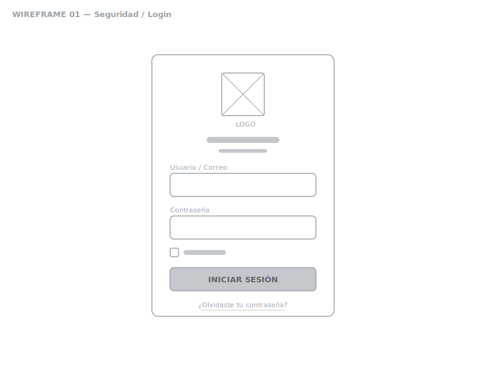
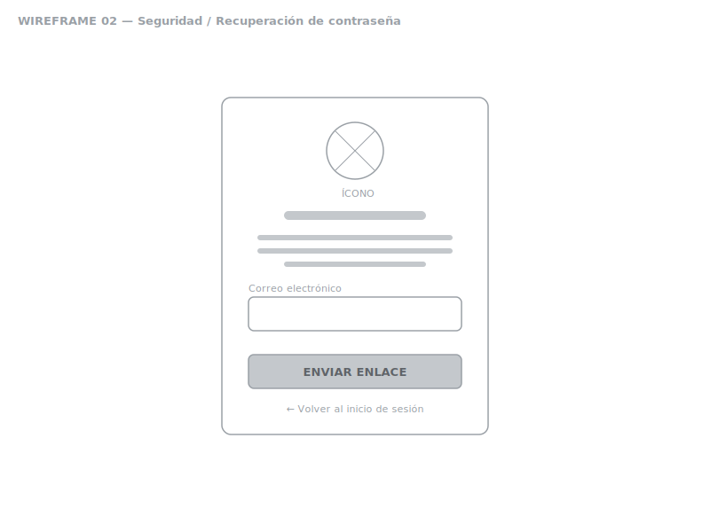
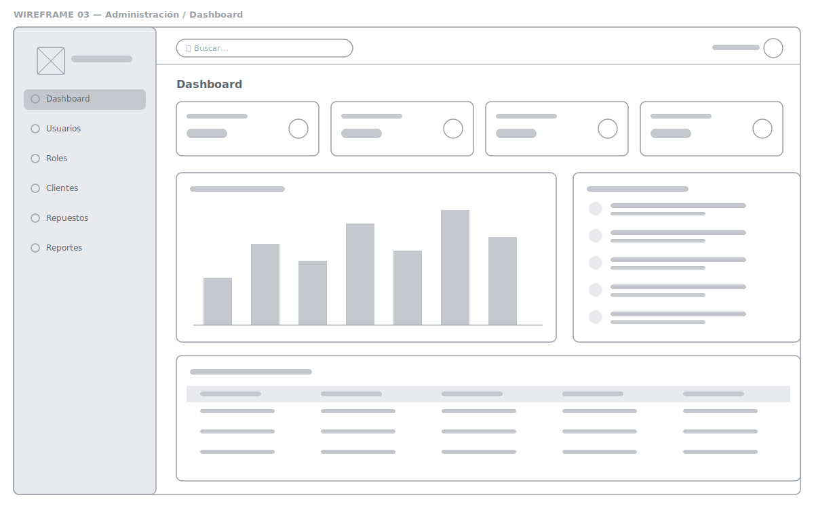
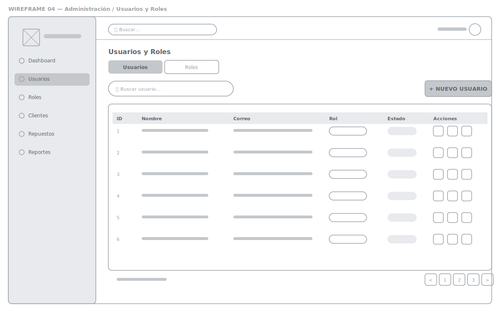
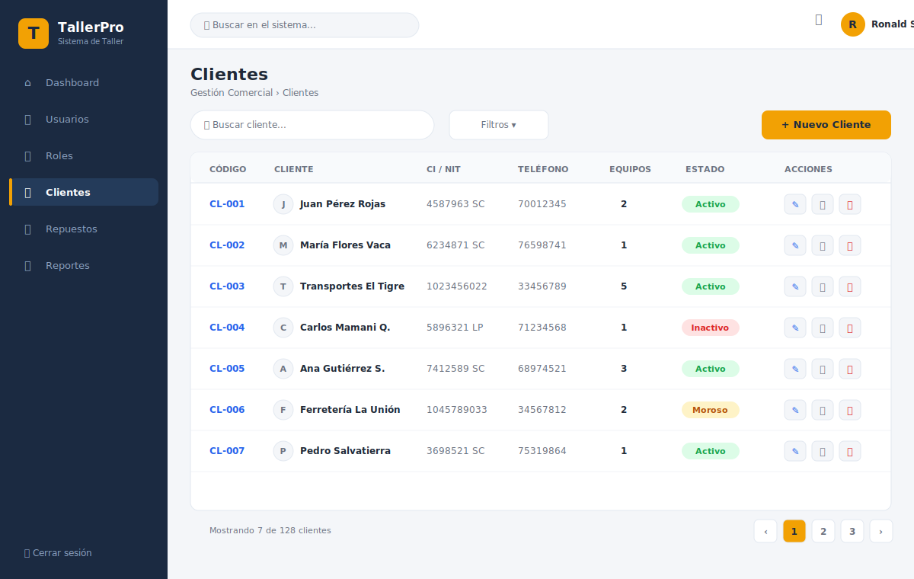
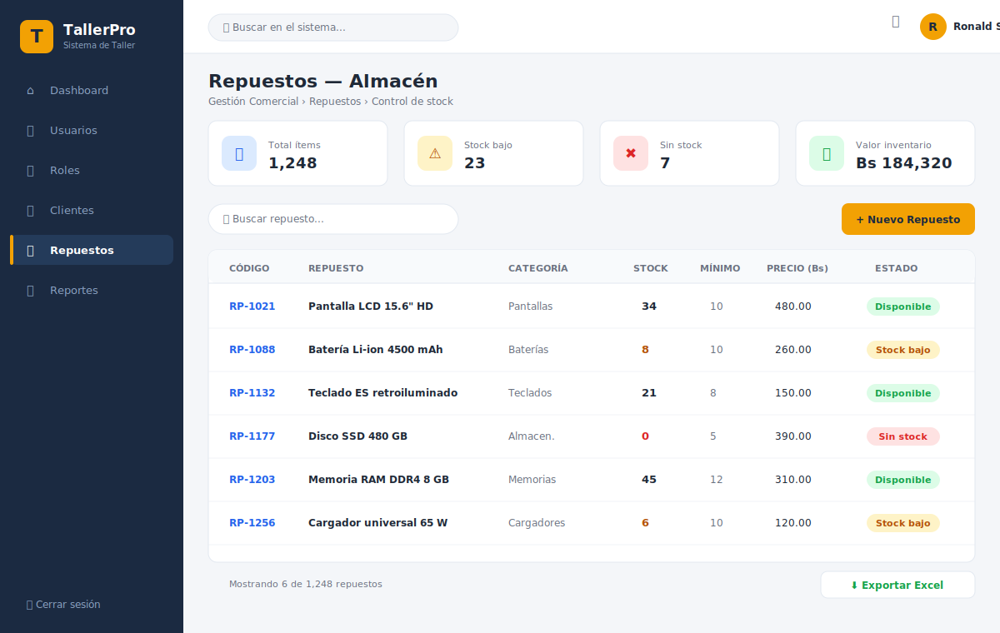
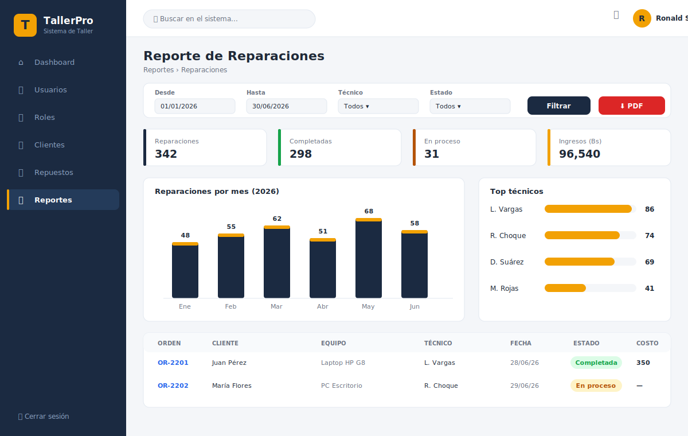
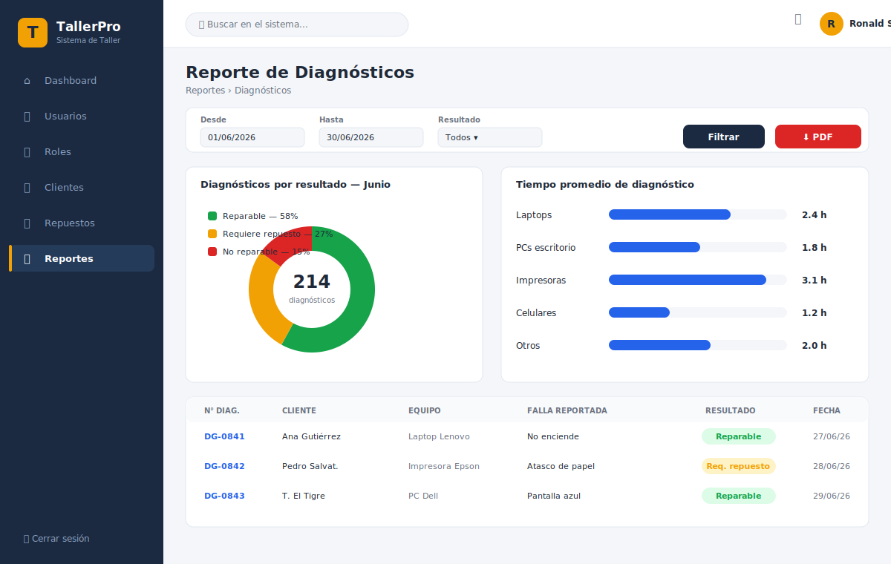

# 🔧 TallerPro — Sistema de Gestión de Taller de Reparaciones

Sistema web desarrollado con **Laravel 12** (PHP 8.2) para la administración integral de un taller de reparaciones: control de usuarios y roles, gestión de clientes, inventario de repuestos y generación de reportes de reparación y diagnóstico.

---

## 📋 Módulos del sistema

| Módulo | Pantallas |
|---|---|
| 🔐 **Seguridad** | Login, Recuperación de contraseña |
| ⚙️ **Administración** | Usuarios, Roles, Dashboard |
| 💼 **Gestión Comercial** | Clientes, Repuestos (almacén / stock) |
| 📊 **Reportes** | Reporte de Reparaciones, Reporte de Diagnósticos |

---

## 🛠️ Tecnologías

- **Backend:** Laravel 12 · PHP 8.2
- **Base de datos:** MySQL / SQLite
- **Frontend:** Blade · CSS
- **Herramientas:** Composer · Git · Visual Studio Code

---

## ✏️ Wireframes (baja fidelidad)

Los wireframes definen la **estructura y distribución** de cada pantalla, sin color ni estilo visual final.

### 1. Seguridad — Login



### 2. Seguridad — Recuperación de contraseña



### 3. Administración — Dashboard



### 4. Administración — Usuarios y Roles



---

## 🎨 Mockups (alta fidelidad)

Los mockups muestran el **diseño visual final** del sistema: paleta de colores, tipografía, componentes e identidad de marca *TallerPro*.

**Paleta:** Azul marino `#1B2A41` (primario) · Ámbar `#F2A104` (acento) · Fondo `#F4F6F9`

### 1. Gestión Comercial — Clientes



### 2. Gestión Comercial — Repuestos (Almacén / Stock)



### 3. Reportes — Reporte de Reparaciones



### 4. Reportes — Reporte de Diagnósticos



---

## 🚀 Instalación del proyecto

```bash
# Clonar el repositorio
git clone https://github.com/RonSalvet/Proyecto-Laravel.git
cd Proyecto-Laravel

# Instalar dependencias
composer install

# Configurar entorno
copy .env.example .env
php artisan key:generate

# Base de datos
php artisan migrate

# Ejecutar servidor de desarrollo
php artisan serve
```

Abrir en el navegador: `http://localhost:8000`

---

## 👤 Autor

**Ronald S.** — Proyecto académico de desarrollo web con Laravel.
